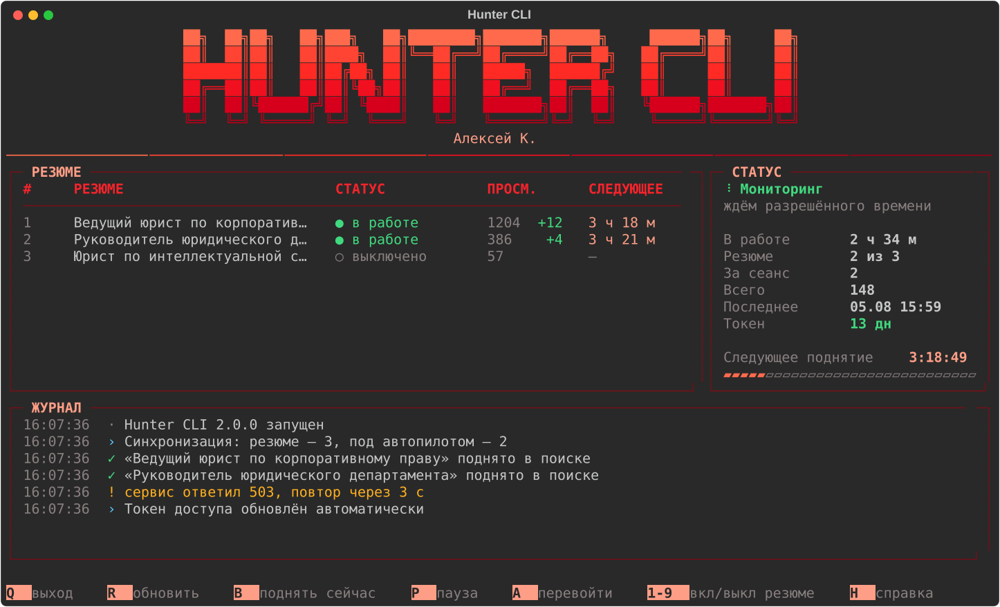

# 🎯 Hunter CLI — автопилот поднятия резюме


<p align="justify">
  <strong>Hunter CLI</strong> — консольная утилита, которая сама поднимает ваши резюме в поиске работодателей. Она спрашивает у сервиса точное время, когда каждое резюме разрешено поднять снова, дожидается этого момента, добавляет случайную задержку — и поднимает резюме без вашего участия. Окно можно свернуть и забыть: всё происходящее видно на одном экране, а токен доступа программа продлевает сама.
</p>



---

## 📑 Оглавление
- [✨ Ключевые возможности](#-ключевые-возможности)
- [⚙️ Как это работает](#️-как-это-работает)
- [💻 Системные требования](#-системные-требования)
- [🚀 Установка (Для пользователей)](#-установка-для-пользователей)
- [⌨️ Управление](#️-управление)
- [🔐 Что и где хранится](#-что-и-где-хранится)
- [❓ FAQ и возможные проблемы](#-faq-и-возможные-проблемы)
- [🛠 Сборка из исходников (Для разработчиков)](#-сборка-из-исходников-для-разработчиков)
- [🧪 Проверки](#-проверки)
- [📄 Лицензия](#-лицензия)
- [💬 Обратная связь](#-обратная-связь)

---

<div align="justify">

## ✨ Ключевые возможности

* 🎯 **Точное время вместо «раз в 4 часа наугад».** Программа берёт из API поле `next_publish_at` — момент, когда поднятие реально разрешено. Попыток «рано» не бывает.
* 🎲 **Случайная задержка 45–240 секунд** после разрешённого времени, чтобы поведение не выглядело машинным. Задержка устойчивая: обратный отсчёт на экране не скачет между обновлениями.
* 🔄 **Токен продлевается сам.** Токен живёт 14 суток; за двое суток до конца программа молча меняет его по `refresh_token`. Заново входить не нужно.
* 🖥 **Живой дашборд:** таблица резюме, обратный отсчёт до следующего поднятия, счётчики за сеанс и за всё время, журнал событий.
* 🔍 **Сама находит все ваши резюме** — ничего не нужно вводить руками. Любое можно выключить одной клавишей.
* 💬 **Понятные ошибки.** «Исчерпан дневной лимит поднятий», а не «код 403».
* 📴 **Пропала сеть — не падает,** а ждёт с нарастающей паузой и пишет об этом в журнал.
* 🔐 **Токен шифруется** средствами Windows (DPAPI) и привязан к вашей учётной записи: скопированный на чужой компьютер `config.json` бесполезен.

## ⚙️ Как это работает

1. **Вход.** При первом запуске открывается окно входа. Пароль остаётся на сайте сервиса — программа его не видит и не хранит, сохраняется только токен доступа.
2. **Синхронизация.** Программа получает список ваших резюме и время, когда каждое можно поднять.
3. **Ожидание.** Всё, что разрешено поднять прямо сейчас, поднимается сразу. Остальное ждёт своего момента плюс случайную задержку.
4. **Поднятие.** Резюме поднимается, результат появляется в журнале, отсчёт начинается заново.

> [!IMPORTANT]
> Это обычная программа, а не служба Windows. **Окно можно свернуть — автопилот продолжит работать. Если окно закрыть, поднятия прекратятся.**
> Ничего при этом не теряется: расписание программа не хранит у себя, а спрашивает у сервиса при каждом запуске. Пропущенные окна не копятся — после перерыва произойдёт одно поднятие, а не три подряд.

## 💻 Системные требования

* **ОС:** Windows 10 или 11. Программа опирается на встроенный WebView2 (окно входа) и DPAPI (шифрование токена).
* **Microsoft Edge WebView2 Runtime.** На Windows 11 и актуальной Windows 10 он уже установлен. Проверить: `HunterCLI.exe --check`.
* **Свободное место:** ~30 МБ.
* **Интернет:** нужен постоянно — программа обращается к API сервиса.

## 🚀 Установка (Для пользователей)

Python устанавливать не нужно, всё уже внутри.

1. Перейдите в раздел [Releases](../../releases).
2. Скачайте `HunterCLI.exe` и положите в любую папку, где у вас есть права на запись (рядом появятся `config.json` и `hunter.log`).
3. Запустите `HunterCLI.exe`.
4. При первом запуске выберите способ входа — по умолчанию подходит первый:

   | | Способ | Когда выбирать |
   |---|---|---|
   | **1** | Окно входа внутри программы | Обычный случай. Вошли — окно закроется само |
   | **2** | Вход в вашем браузере | Если окно из пункта 1 не открылось |
   | **3** | Вставить ссылку или токен вручную | Если не сработало ничего другого |

5. Дальше ничего делать не нужно. Сверните окно.

> [!TIP]
> Если что-то идёт не так, запустите `HunterCLI.exe --check` — программа проверит окружение (WebView2, права на запись, связь с сервисом) и покажет, чего не хватает.

## ⌨️ Управление

Работают и латинские, и русские буквы на тех же клавишах — раскладку переключать не нужно.

| Клавиша | Действие |
|---|---|
| `Q` | Выйти (автопилот остановится) |
| `R` | Перечитать список резюме прямо сейчас |
| `B` | Поднять всё, что разрешено поднять сию секунду |
| `P` | Пауза: резюме перестают подниматься, но окно живёт |
| `A` | Войти в аккаунт заново |
| `1`…`9` | Включить или выключить резюме под этим номером в таблице |
| `L` | Открыть файл журнала |
| `H` | Справка |

## 🔐 Что и где хранится

| Файл | Что внутри |
|---|---|
| `config.json` | Зашифрованный токен, выбранные резюме, статистика |
| `hunter.log` | Журнал событий; при росте свыше 1 МБ уходит в `hunter.log.1` |
| `%LOCALAPPDATA%\HunterCLI\` | Сессия окна входа — благодаря ей повторный вход обычно проходит в один клик |

Настройки в `config.json` правятся вручную при закрытой программе:

| Параметр | По умолчанию | Смысл |
|---|---|---|
| `jitter_min_sec` / `jitter_max_sec` | `45` / `240` | Границы случайной задержки |
| `sync_interval_sec` | `900` | Как часто перечитывать список резюме |
| `managed_resumes` | `null` | `null` — все резюме; либо список id |
| `quiet_hours` | `null` | Напр. `[23, 7]` — не поднимать с 23:00 до 7:00 |
| `log_lines` | `400` | Сколько строк журнала держать на экране |

## ❓ FAQ и возможные проблемы

> [!WARNING]
> **Окно входа открылось, но ничего не происходит.**
> Скорее всего не установлен Microsoft Edge WebView2 Runtime. Проверьте командой `HunterCLI.exe --check`. Если его нет — поставьте [Evergreen Runtime от Microsoft](https://developer.microsoft.com/microsoft-edge/webview2/) или войдите способом 2 (обычный браузер).

> [!NOTE]
> **Программа просит войти заново, хотя я недавно входил.**
> Токен действует 14 суток и продлевается автоматически, но только когда программа запущена. Если её не открывать пару недель, токен успевает истечь — тогда нужен повторный вход. Это нормально и занимает несколько секунд.

> [!NOTE]
> **В журнале «исчерпан дневной лимит поднятий».**
> Это ответ сервиса, а не ошибка программы. Hunter CLI не обходит ограничения площадки: он выдерживает паузу 30 минут и пробует снова. Клавиша `B` пробивает паузу принудительно.

> [!NOTE]
> **Окно слишком маленькое.**
> Интерфейс подстраивается под ширину от 58 символов: логотип уменьшается, лишние столбцы скрываются. Совсем в узком окне программа скажет, какой размер ей нужен.

## 🛠 Сборка из исходников (Для разработчиков)

Нужен Python 3.10+ (проверено на 3.12, 64-bit). Интерфейс — [Rich](https://github.com/Textualize/rich), окно входа — [pywebview](https://github.com/r0x0r/pywebview) поверх WebView2, сборка — PyInstaller.

```cmd
build.bat
```

Готовый `HunterCLI.exe` появится в папке `dist`.

Структура проекта:

| Файл | Ответственность |
|---|---|
| `main.py` | Запуск; режимы `--check`, `--version`, приём ссылки от браузера |
| `huntercli/auth.py` | Вход: окно, снятие куки сессии, обмен на токен |
| `huntercli/hh.py` | Клиент API, повторы запросов, продление токена |
| `huntercli/engine.py` | Планирование и поднятие в фоновом потоке |
| `huntercli/config.py` | Конфиг, миграция со старой версии, статистика |
| `huntercli/secrets.py` | Шифрование токена через Windows DPAPI |
| `huntercli/ui/` | Дашборд, экраны входа, палитра, клавиатура |

## 🧪 Проверки

```cmd
python tests\run_all.py
```

Сеть для этого не нужна: API и страница входа поднимаются локально. Ключ `--live` добавляет проверки против настоящего сервиса (вход в аккаунт при этом не требуется):

```cmd
python tests\run_all.py --live
```

После прогона `tests\render-preview.txt` показывает, как выглядит интерфейс на разной ширине окна. Картинку для этого README пересобирает `python tools\make_preview.py`.

## 📄 Лицензия

Copyright (c) 2026 Алексей Коняев

Hunter CLI распространяется под лицензией **GNU AGPL v3** (см. файл
[`LICENSE`](LICENSE)) — той же, что и [Umbra](https://github.com/akonyaev-ru/Umbra).

Что это значит на практике:

* **Пользоваться программой** может кто угодно и для чего угодно, в том числе на работе. Никаких ограничений.
* **Изменять и распространять** её тоже можно — но производная работа обязана остаться под AGPL v3 с открытыми исходниками. Взять этот код, закрыть его и продавать как свой продукт нельзя.
* **Сетевой сервис** на её основе приравнивается к распространению (это и есть отличие AGPL от обычной GPL): если кто-то поднимет из этого кода веб-сервис, он обязан открыть исходники всем его пользователям.

> [!NOTE]
> Лицензия выбрана осознанно, а не по необходимости: все зависимости
> разрешительные (`requests` — Apache 2.0, `rich` и `pythonnet` — MIT,
> `pywebview` — BSD, `PyInstaller` — GPLv2+ с исключением для несвободных
> программ), и формально подошла бы любая. AGPL взята ради того, чтобы
> производные оставались открытыми.

**Коммерческое использование на других условиях.** Все права на код принадлежат
автору, поэтому AGPL — не единственный вариант: если вам нужно использовать
Hunter CLI в закрытом продукте, напишите — обсудим отдельную лицензию.

## 💬 Обратная связь

Нашли ошибку или есть идея, как сделать программу лучше? Заведите
[issue](../../issues) — к сообщению очень поможет файл `hunter.log`, он лежит
рядом с программой и не содержит ни токена, ни пароля.

</div>
