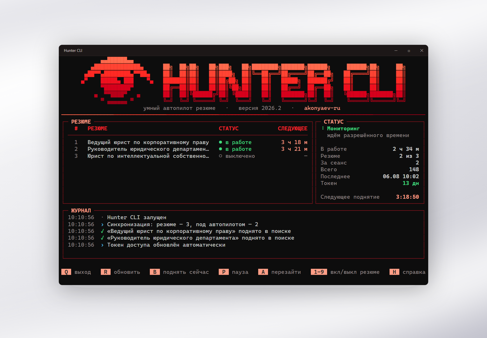

# Hunter CLI — умный автопилот резюме


<p align="justify">
  <strong>Hunter CLI</strong> — консольная утилита для автоматического поднятия резюме в поиске работодателей. Программа запрашивает у сервиса точное время, когда очередное поднятие разрешено, дожидается этого момента, добавляет случайную задержку и выполняет поднятие без участия пользователя. Ход работы отображается на одном экране, токен доступа продлевается автоматически.
</p>



---

## 📑 Оглавление
- [✨ Возможности](#-возможности)
- [⚙️ Принцип работы](#️-принцип-работы)
- [💻 Системные требования](#-системные-требования)
- [🚀 Установка](#-установка)
- [⌨️ Управление](#️-управление)
- [🌙 Работа при спящем режиме](#-работа-при-спящем-режиме)
- [🔐 Хранение данных](#-хранение-данных)
- [❓ Частые вопросы](#-частые-вопросы)
- [🛠 Сборка из исходных текстов](#-сборка-из-исходных-текстов)
- [🧪 Проверки](#-проверки)
- [📄 Лицензия](#-лицензия)
- [💬 Обратная связь](#-обратная-связь)

---

<div align="justify">

## ✨ Возможности

* 🎯 **Точное расписание.** Время очередного поднятия берётся из API (поле `next_publish_at`), поэтому преждевременных обращений к сервису не происходит.
* 🎲 **Случайная задержка 45–240 секунд** после разрешённого времени. Задержка устойчива между обновлениями, поэтому обратный отсчёт на экране не смещается.
* 🔄 **Автоматическое продление токена.** Срок действия токена составляет 14 суток; за двое суток до истечения программа обновляет его самостоятельно.
* 🌙 **Устойчивость к спящему режиму.** Программа препятствует засыпанию по бездействию и способна вывести компьютер из сна к моменту поднятия.
* 🖥 **Информативный интерфейс:** таблица резюме, обратный отсчёт, счётчики за сеанс и за всё время, журнал событий.
* 🔍 **Автоматический поиск резюме.** Список загружается из профиля; любое резюме отключается одной клавишей.
* 💬 **Понятные сообщения об ошибках** вместо кодов ответа сервиса.
* 📴 **Корректная обработка обрыва связи.** При недоступности сети программа ожидает с нарастающей паузой и сообщает об этом в журнале.
* 🔐 **Шифрование токена** средствами Windows (DPAPI) с привязкой к учётной записи. Файл `config.json`, скопированный на другой компьютер, использовать нельзя.

## ⚙️ Принцип работы

1. **Авторизация.** При первом запуске открывается окно входа. Пароль вводится на сайте сервиса и программе не передаётся; сохраняется только токен доступа.
2. **Синхронизация.** Загружается список резюме и время, когда каждое из них разрешено поднять.
3. **Ожидание.** Резюме, доступные к поднятию немедленно, обрабатываются сразу. Остальные ожидают наступления разрешённого времени плюс случайную задержку.
4. **Поднятие.** Результат операции отражается в журнале, после чего отсчёт начинается заново.

> [!IMPORTANT]
> Hunter CLI является обычным приложением, а не системной службой. **Окно допускается сворачивать, автопилот продолжит работу. При закрытии окна поднятия прекращаются.**
> Данные при этом не теряются: расписание запрашивается у сервиса при каждом запуске. Пропущенные интервалы не накапливаются, после перерыва выполняется одно поднятие.

## 💻 Системные требования

| Требование | Значение |
|---|---|
| Операционная система | Windows 10 или 11 |
| Дополнительные компоненты | Microsoft Edge WebView2 Runtime (входит в состав актуальных версий Windows) |
| Свободное место | около 30 МБ |
| Подключение к интернету | требуется постоянно |

Проверить готовность окружения можно командой `HunterCLI.exe --check`.

## 🚀 Установка

Установка Python не требуется, все компоненты входят в состав исполняемого файла.

1. Откройте раздел [Releases](../../releases).
2. Загрузите `HunterCLI.exe`. Распаковка не нужна.
3. Поместите файл в каталог, доступный для записи: рядом будут созданы `config.json` и `hunter.log`.
4. Запустите программу и выберите способ авторизации:

   | | Способ | Когда применять |
   |---|---|---|
   | **1** | Окно входа внутри программы | Основной вариант. Окно закрывается автоматически после успешного входа |
   | **2** | Вход в браузере по умолчанию | Если окно из первого пункта не открылось |
   | **3** | Ввод ссылки или токена вручную | Резервный вариант |

5. Дальнейших действий не требуется. Окно можно свернуть.

## ⌨️ Управление

Клавиши распознаются как в латинской, так и в кириллической раскладке.

| Клавиша | Действие |
|---|---|
| `Q` | Завершить работу |
| `R` | Обновить список резюме |
| `B` | Поднять все резюме, доступные в данный момент |
| `P` | Приостановить поднятия без закрытия окна |
| `A` | Выполнить повторный вход |
| `1`…`9` | Включить или отключить резюме с указанным номером |
| `L` | Открыть файл журнала |
| `H` | Справка |

## 🌙 Работа при спящем режиме

Поведение программы в различных состояниях компьютера:

| Состояние | Поведение |
|---|---|
| Блокировка экрана | Работа продолжается без ограничений |
| Простой системы | Засыпание по бездействию блокируется, экран при этом гаснуть может |
| Сон системы | Выполнение приостанавливается; программа заводит таймер пробуждения к моменту поднятия |
| Выход из сна | Выполняется немедленная синхронизация с сервисом, о чём сообщается в журнале |

> [!NOTE]
> Действие при закрытии крышки ноутбука определяется параметрами электропитания Windows и приложением не изменяется. Если требуется работа с закрытой крышкой, установите для соответствующего действия значение «Ничего не делать» в разделе «Электропитание».
>
> Пробуждение из сна требует, чтобы в параметрах электропитания были разрешены таймеры пробуждения. По умолчанию они разрешены, однако могут быть отключены политикой организации или режимом энергосбережения.

Оба механизма отключаются в файле `config.json` параметрами `prevent_sleep` и `wake_from_sleep`.

## 🔐 Хранение данных

| Расположение | Содержимое |
|---|---|
| `config.json` | Зашифрованный токен, перечень выбранных резюме, статистика |
| `hunter.log` | Журнал событий; при достижении 1 МБ переносится в `hunter.log.1` |
| `%LOCALAPPDATA%\HunterCLI\` | Сессия окна авторизации, благодаря которой повторный вход выполняется в один шаг |

Параметры в файле `config.json` изменяются вручную при закрытой программе:

| Параметр | По умолчанию | Назначение |
|---|---|---|
| `jitter_min_sec` / `jitter_max_sec` | `45` / `240` | Границы случайной задержки |
| `sync_interval_sec` | `900` | Периодичность обновления списка резюме |
| `managed_resumes` | `null` | `null` соответствует всем резюме; допускается список идентификаторов |
| `quiet_hours` | `null` | Например, `[23, 7]` запрещает поднятия с 23:00 до 7:00 |
| `prevent_sleep` | `true` | Блокировать засыпание по бездействию |
| `wake_from_sleep` | `true` | Выводить компьютер из сна к моменту поднятия |
| `log_lines` | `400` | Количество строк журнала на экране |

## ❓ Частые вопросы

> [!WARNING]
> **Окно входа открылось, но авторизация не завершается.**
> Вероятная причина: отсутствует Microsoft Edge WebView2 Runtime. Выполните `HunterCLI.exe --check`. При отсутствии компонента установите [Evergreen Runtime](https://developer.microsoft.com/microsoft-edge/webview2/) либо воспользуйтесь вторым способом авторизации.

> [!NOTE]
> **Программа запрашивает повторный вход.**
> Токен действует 14 суток и продлевается автоматически только во время работы программы. При перерыве свыше двух недель требуется повторная авторизация. Процедура занимает несколько секунд.

> [!NOTE]
> **В журнале указано «исчерпан дневной лимит поднятий».**
> Это ответ сервиса. Hunter CLI не обходит установленные ограничения: программа выдерживает паузу 30 минут и повторяет попытку. Клавиша `B` выполняет поднятие принудительно.

> [!NOTE]
> **Интерфейс отображается некорректно в узком окне.**
> Интерфейс рассчитан на ширину от 58 символов. При уменьшении окна логотип масштабируется, а вспомогательные столбцы скрываются. При недостаточном размере выводится требуемое значение.

## 🛠 Сборка из исходных текстов

Требуется Python 3.10 или новее (проверено на 3.12, 64-bit). Интерфейс построен на [Rich](https://github.com/Textualize/rich), окно авторизации использует [pywebview](https://github.com/r0x0r/pywebview) поверх WebView2, сборка выполняется средствами PyInstaller.

```cmd
build.bat
```

Готовый файл `HunterCLI.exe` создаётся в каталоге `dist`.

Состав проекта:

| Файл | Назначение |
|---|---|
| `main.py` | Точка входа, режимы `--check`, `--version`, `--license` |
| `huntercli/auth.py` | Авторизация: окно входа, получение сессии, обмен на токен |
| `huntercli/hh.py` | Клиент API, повтор запросов, продление токена |
| `huntercli/engine.py` | Планирование и выполнение поднятий в фоновом потоке |
| `huntercli/power.py` | Взаимодействие с электропитанием: сон, пробуждение |
| `huntercli/config.py` | Конфигурация, миграция настроек, статистика |
| `huntercli/secrets.py` | Шифрование токена средствами Windows DPAPI |
| `huntercli/ui/` | Интерфейс: панель мониторинга, экраны входа, палитра |
| `tools/make_icon.py` | Сборка `icon.ico` и матрицы логотипа из `logo.png` |
| `tools/make_preview.py` | Формирование иллюстрации для настоящего документа |

Служебные сценарии в каталоге `tools` требуют библиотеки Pillow:

```cmd
python -m pip install Pillow
```

## 🧪 Проверки

```cmd
python tests\run_all.py
```

Подключение к сети не требуется: API и страница авторизации поднимаются локально. Ключ `--live` добавляет проверки с обращением к действующему сервису, авторизация при этом не нужна:

```cmd
python tests\run_all.py --live
```

После выполнения файл `tests\render-preview.txt` содержит изображение интерфейса при различной ширине окна.

## 📄 Лицензия

Copyright (c) 2026 Алексей Коняев

Hunter CLI распространяется на условиях **GNU AGPL v3**, полный текст приведён в файле [`LICENSE`](LICENSE).

Основные положения:

* **Использование** программы не ограничено, в том числе в коммерческих организациях.
* **Изменение и распространение** допускаются при условии, что производная работа сохраняет лицензию AGPL v3 и остаётся с открытыми исходными текстами.
* **Предоставление в качестве сетевого сервиса** приравнивается к распространению: исходные тексты должны быть доступны пользователям такого сервиса.

> [!NOTE]
> Лицензия выбрана добровольно. Все зависимости являются разрешительными (`requests` — Apache 2.0, `rich` и `pythonnet` — MIT, `pywebview` — BSD, `PyInstaller` — GPLv2 с исключением для несвободных программ), поэтому применимой являлась бы любая лицензия.

**Использование на иных условиях.** Права на исходный код принадлежат автору, поэтому AGPL не является единственно возможным вариантом. По вопросам использования Hunter CLI в закрытом продукте обращайтесь к автору.

## 💬 Обратная связь

Сообщения об ошибках и предложения принимаются через раздел [issues](../../issues). К сообщению об ошибке желательно приложить файл `hunter.log`, который располагается рядом с программой и не содержит ни пароля, ни токена.

</div>
